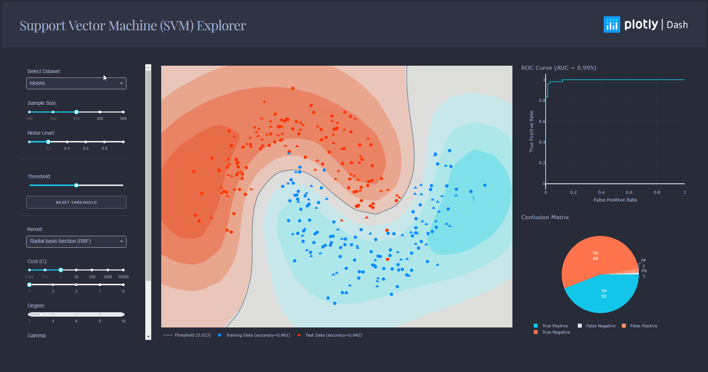

# Decision Boundary Explorer

This is a learning tool and exploration app made using the Dash interactive Python framework developed by [Plotly](https://plot.ly/).




## Getting Started
### Using the demo
This demo lets you interactive explore Support Vector Machine (SVM) and Gaussian Naïve Bayes (GNB). 

It includes a few artificially generated datasets that you can choose from the dropdown, and that you can modify by changing the sample size and the noise level of those datasets.

The other dropdowns and sliders lets you change the parameters of your classifier, such that it could increase or decrease its accuracy.

### Running the app locally

Clone the git repo, then install the requirements with pip
```
git clone https://github.com/jehasbani/decision_boundary_django_dash
cd decision_boundary_django_dash
pip install -r requirements.txt
```

Run the app
```
python svm_app.py
```

## About the app
### How does it work?

This app is fully written in Dash + scikit-learn. All the components are used as input parameters for scikit-learn functions, which then generates a model with respect to the parameters you changed. The model is then used to perform predictions that are displayed on a contour plot, and its predictions are evaluated to create the ROC curve and confusion matrix.

In addition to creating models, scikit-learn is used to generate the datasets you see, as well as the data needed for the metrics plots.

### What is a SVM model?
An SVM is a popular Machine Learning model used in many different fields. You can find more info about the SVM model [here](https://scikit-learn.org/stable/modules/svm.html).

### What is a Gaussian Naïve Bayes classifier?
The Naïve Bayes classifier is a generative classification method popular for its simplicity and good performance. You can find more about GNB [here](https://scikit-learn.org/stable/modules/naive_bayes.html).


## Built With
* [Dash](https://dash.plot.ly/) - Main server and interactive components
* [Plotly Python](https://plot.ly/python/) - Used to create the interactive plots
* [Scikit-Learn](http://scikit-learn.org/stable/documentation.html) - Run the classification algorithms and generate datasets
* [Django](https://docs.djangoproject.com/en/3.1/)


## Author
* **Jonathan Hasbani** - [@jehasbani](https://github.com/jehasbani)


## Acknowledgments
The dashboard layout was inspired by this [dash app](https://github.com/plotly/dash-sample-apps/tree/master/apps/dash-svm)

